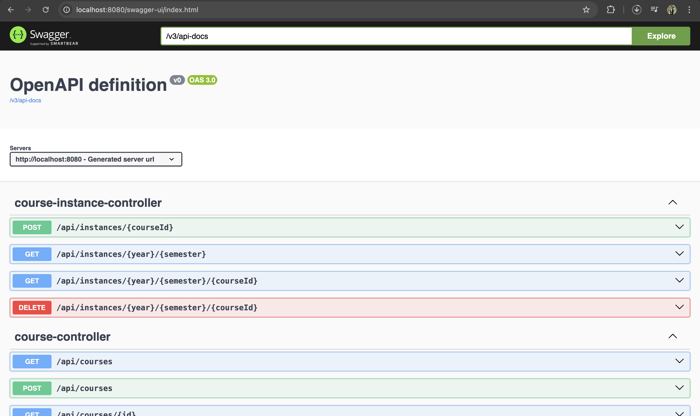
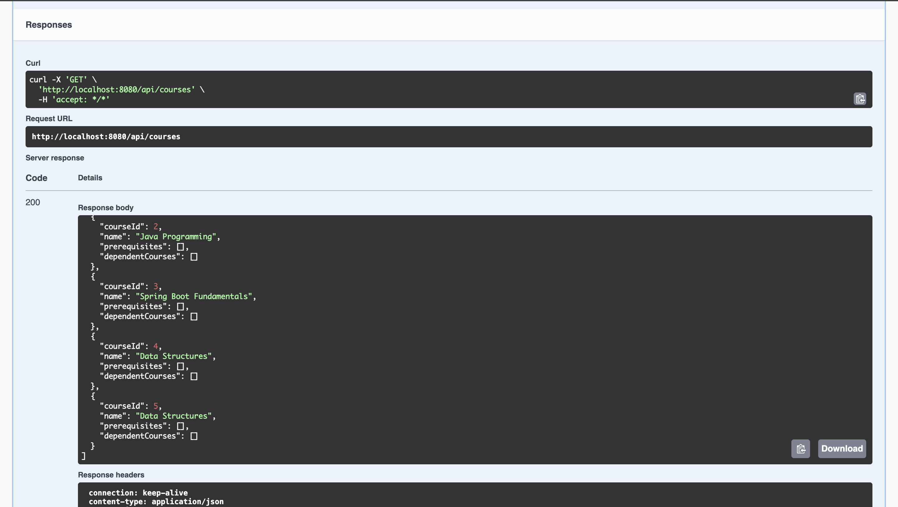
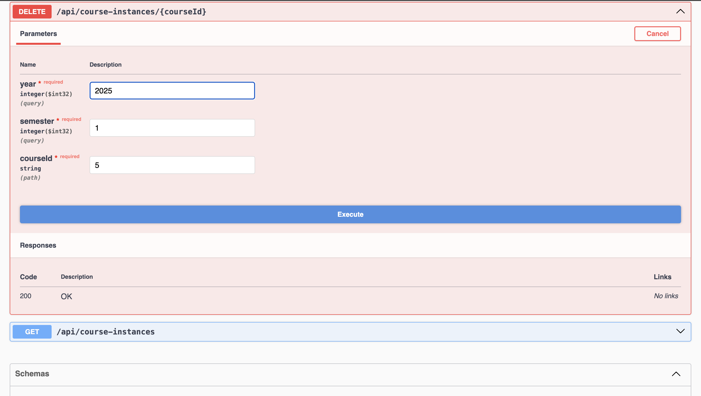
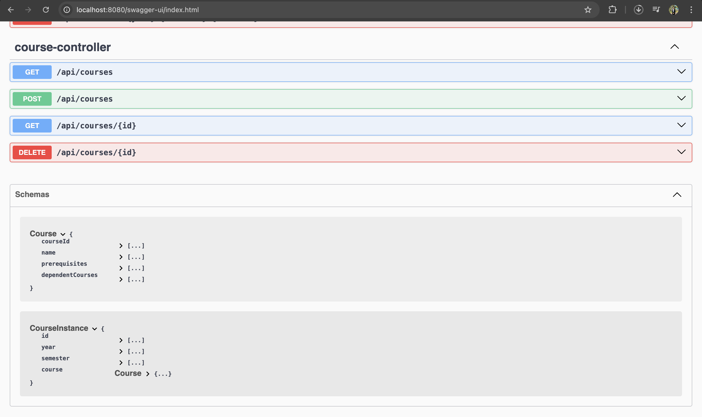
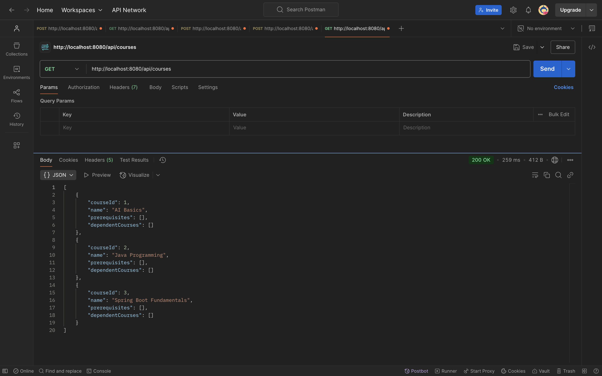
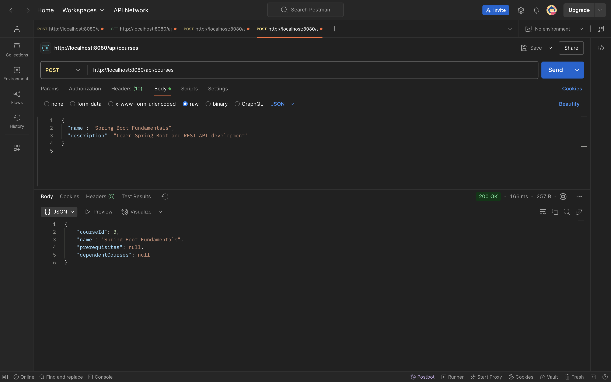

# 📚 IIT Bombay Courses API Project

This project is built as part of a technical assignment for **IIT Bombay**, focusing on building a robust Courses API. The system manages courses, their prerequisites, and course instances.

---

## 🛠️ Tech Stack

- Java 17
- Spring Boot
- MySQL
- JPA/Hibernate
- Swagger UI
- Postman (for manual API testing)

---

## 📁 Project Structure

IIT_bombay_Courses-API-Project/
│
├── src/
│ └── main/
│ ├── java/com/iitb/courses/
│ └── resources/
├── pom.xml
├── README.md
├── Swagger_Page.png
├── Swagger-GetApi's.png
├── Swagger-DeleteApi.png
├── Swagger-PostApiTest-api-courses.png
├── Swagger-PostApi-courseInstance.png
├── SwaggerPage2.png
├── PostMan-GetApiTesting.png
├── PostMan-PostApiTesting.png
├── File-Structure-Intellij.png

yaml
Copy
Edit


---

## 🔗 Swagger Documentation

Accessible at:  
**[http://localhost:8080/swagger-ui.html](http://localhost:8080/swagger-ui.html)**

This UI provides endpoints for:
- Creating courses
- Managing course prerequisites
- Creating & deleting course instances
- Filtering by semester & year

### 📸 Swagger Screenshots:

#### ✅ Main Swagger UI Page


#### ✅ POST API for Courses


#### ✅ POST API for CourseInstance


#### ✅ GET APIs


#### ✅ DELETE CourseInstance API


#### ✅ Swagger - All API Views Expanded


---

## 📬 Postman API Testing

Testing was also done on Postman for further confirmation.

#### 🧪 GET API


#### 🧪 POST API


---

## ✅ API Endpoints Summary

| Method | Endpoint                                | Description                          |
|--------|-----------------------------------------|--------------------------------------|
| POST   | `/api/courses`                          | Create a course                      |
| GET    | `/api/courses`                          | Get all courses                      |
| GET    | `/api/courses/{id}`                     | Get course by ID                     |
| POST   | `/api/course-instances/{courseId}`      | Create instance for a course         |
| GET    | `/api/course-instances?year=&semester=` | Get instances by year & semester     |
| GET    | `/api/course-instances/{courseId}`      | Get instance by courseId, year, sem  |
| DELETE | `/api/course-instances/{courseId}`      | Delete instance                      |

---

## 💡 How to Run Locally

```bash
# 1. Clone the repo
git clone https://github.com/your-username/IIT_bombay_Courses-API-Project.git

# 2. Navigate into the project
cd IIT_bombay_Courses-API-Project/courses-api

# 3. Start MySQL and update credentials in application.properties

# 4. Run the app
./mvnw spring-boot:run
Then open Swagger at http://localhost:8080/swagger-ui.html

🧠 Developed By
👩‍💻 Tanvi Sharma
This project was created under academic guidance as part of IIT Bombay's backend API assignment.

⭐ GitHub Repo
Feel free to ⭐️ this repo if you find it helpful!
Pull requests, feedback, or questions are welcome. 😊


