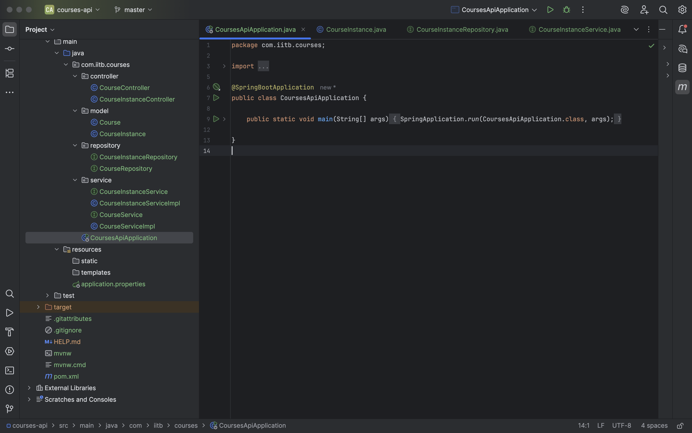

# 📚 IIT Bombay – Courses API Project

This project was developed under a backend development initiative by **IIT Bombay**. It demonstrates a robust RESTful API system built using **Spring Boot** and **MySQL**, capable of managing university courses and semester-wise course instances with prerequisite relationships.

---

## 🏗️ Project Structure

The backend is structured using a clean layered architecture.

📸 Project Folder in IntelliJ:  


📦 courses-api
┣ 📂controller
┣ 📂service
┣ 📂repository
┣ 📂model
┣ 📂exception
┣ 📜application.properties
┗ 📜CoursesApiApplication.java

yaml
Copy
Edit

---

## 🚀 Tech Stack

- **Java 17**
- **Spring Boot 3.2.5**
- **Spring Data JPA**
- **MySQL**
- **Swagger (OpenAPI v3)**
- **Postman**

---

## 🔌 Configuration

Inside `application.properties`:

```properties
spring.datasource.url=jdbc:mysql://localhost:3306/courses_api
spring.datasource.username=root
spring.datasource.password=your_password
spring.jpa.hibernate.ddl-auto=update
spring.jpa.show-sql=true
springdoc.api-docs.path=/v3/api-docs
springdoc.swagger-ui.path=/swagger-ui.html
🧪 API Testing via Swagger UI
You can open Swagger UI by visiting:
👉 http://localhost:8080/swagger-ui.html

📸 Main Swagger Page:

📸 Additional APIs Listed:

📥 Create a Course
Method: POST /api/courses

Request Body:

json
Copy
Edit
{
  "name": "Data Structures",
  "prerequisites": []
}
📸 Swagger Test:

📸 Postman Test:

📤 Get All Courses
Method: GET /api/courses

📸 Swagger Test:

📸 Postman Test:

📥 Create Course Instance
Method: POST /api/course-instances/{courseId}

Request Body:

json
Copy
Edit
{
  "year": 2025,
  "semester": 1
}
📸 Swagger Test:

❌ Delete Course Instance
Method: DELETE /api/course-instances/{courseId}?year=2025&semester=1

📸 Swagger Test:

🎯 Features
📘 Course Prerequisites – Many-to-Many Self-Referencing

📆 Course Instances – Created per Semester & Year

✅ Full CRUD operations

🔒 Validations and Exception Handling

🧪 Fully tested with Swagger & Postman

🔧 Easy to extend and maintain

🔗 Quick Access
🔍 Swagger API Documentation

👩‍💻 Developed By
Tanvi Sharma
🔗 LinkedIn Profile

📄 License
This is an educational project built under the guidance of IIT Bombay.
Usage is permitted for learning and academic purposes.

yaml
